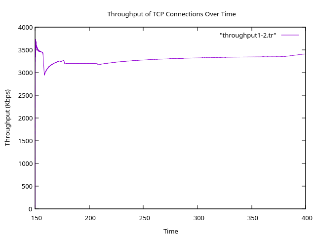
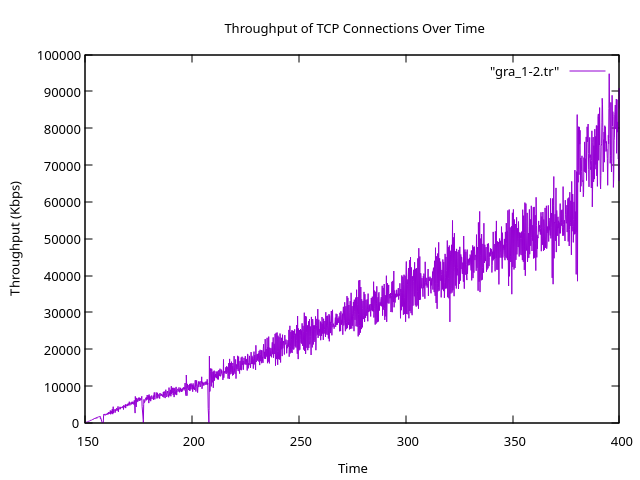

# evaluate-network-performance
Evaluate network performance.  INT 3308 UET-VNU

Student: Nguyen Dinh Hoang - 20021361

## 1. Xây dựng mạng mô phỏng dựa trên wireless1.tcl, với một số thay đổi về topo và kịch bản thực hiện như sau:
- Chọn số node mạng: thay đổi giá trị gán cho biến nn trong [wireless1.tcl](./wireless/wireless1.tcl) (74 - Nguyen Dinh Hoang)
  ```tcl
  set val(nn)             74	;# how many nodes are simulated
  ...
  set val(sc)	"./20021361.txt"		;#sc= scenario= movement pattern 
  ```
- Sinh mẫu chuyển động (movement pattern) để sử dụng trong kịch bản mô phỏng bằng cách sử dụng công cụ setdest (version 1) có sẵn trong ns2.
  ```bash
  setdest -v 1 -n 50 -t 400 -M5 -p 1 -x 670 -y 670 > 20021361.txt
  ```
- Sử dụng giao thức định tuyến AODV (“set val(adhocRouting) AODV”)
  ```tcl
  set val(adhocRouting)	AODV	;# AODV/DSDV/TORA...
  ```
  ```bash
  ns wireless1.tcl
  ```
- Kết quả mô phỏng được lưu trong file [wireless1.tr](./wireless/wireless1-out.tr) và [wireless1.nam](./wireless/wireless1-out.nam)
  ```bash
  num_nodes is set 74
  warning: Please use -channel as shown in tcl/ex/wireless-mitf.tcl
  INITIALIZE THE LIST xListHead
  Loading connection pattern...
  Loading scenario file...
  Starting Simulation...
  channel.cc:sendUp - Calc highestAntennaZ_ and distCST_
  highestAntennaZ_ = 1.5,  distCST_ = 550.0
  SORTING LISTS ...DONE!
  NS EXITING...
  ```
## 2. Chạy mô phỏng để ns2 sinh ra tệp vết, sau đó phân tích tệp vết (sử dụng Perl hoặc các lệnh của hệ điều hành Ubuntu) để tính (đánh giá) các độ đo hiệu năng sau đây:
### 2.1. Độ trễ định tuyến 
#### 2.1.1: Tính riêng cho từng kết nối
- Đối với CBR 
  ```bash
  cat wireless1-out.tr|grep -m 34 -E '^S|DSR|cbr' | grep AGT
  ```
  ```bash
  s 127.936679222 _0_ AGT  --- 0 cbr 512 [0 0 0 0] ------- [0:0 2:0 32 0] [0] 0 3
  r 130.018521598 _2_ AGT  --- 0 cbr 532 [13a 2 1 800] ------- [0:0 2:0 29 2] [0] 2 3
  s 132.160202086 _0_ AGT  --- 1 cbr 512 [0 0 0 0] ------- [0:0 2:0 32 0] [1] 0 3
  r 132.172182232 _2_ AGT  --- 1 cbr 532 [13a 2 1 800] ------- [0:0 2:0 29 2] [1] 2 3
  s 137.525390576 _0_ AGT  --- 2 cbr 512 [0 0 0 0] ------- [0:0 2:0 32 0] [2] 0 3
  r 137.537630723 _2_ AGT  --- 2 cbr 532 [13a 2 1 800] ------- [0:0 2:0 29 2] [2] 2 3
  s 141.848008290 _0_ AGT  --- 3 cbr 512 [0 0 0 0] ------- [0:0 2:0 32 0] [3] 0 3
  ```
  Độ trễ dịnh tuyến được xác định cbr node 0 tới node 2 bằng:
  ```bash
  s 127.936679222 _0_ AGT  --- 0 cbr 512 [0 0 0 0] ------- [0:0 2:0 32 0] [0] 0 3
  s 132.160202086 _0_ AGT  --- 1 cbr 512 [0 0 0 0] ------- [0:0 2:0 32 0] [1] 0 3
  ```
  `latency_node_0_2 = 132.160202086 - 127.936679222 = 4.22352286`
- Đối với TCP
  ```bash
  cat wireless1-out.tr|grep -m 60 -E '^S|DSR|tcp|ack'|grep '^s'
  ```
  ```bash
  s 150.000000000 _1_ AGT  --- 6 tcp 40 [0 0 0 0] ------- [1:0 2:1 32 0] [0 0] 0 1
  s 150.009112415 _1_ RTR  --- 6 tcp 40 [0 0 0 0] ------- [1:0 2:1 30 2] [0 0] 0 1
  s 150.032855663 _1_ MAC  --- 6 tcp 98 [13a 2 1 800] ------- [1:0 2:1 30 2] [0 0] 0 1
  s 150.033665463 _2_ AGT  --- 7 ack 40 [0 0 0 0] ------- [2:1 1:0 32 0] [0 0] 0 1
  s 150.033665463 _2_ RTR  --- 7 ack 40 [0 0 0 0] ------- [2:1 1:0 30 1] [0 0] 0 1
  s 150.034902062 _2_ MAC  --- 7 ack 98 [13a 1 2 800] ------- [2:1 1:0 30 1] [0 0] 0 1
  s 150.035711862 _1_ AGT  --- 8 tcp 1040 [0 0 0 0] ------- [1:0 2:1 32 0] [1 0] 0 1
  s 150.035711862 _1_ AGT  --- 9 tcp 1040 [0 0 0 0] ------- [1:0 2:1 32 0] [2 0] 0 1
  s 150.035711862 _1_ RTR  --- 8 tcp 1040 [0 0 0 0] ------- [1:0 2:1 30 2] [1 0] 0 1
  s 150.035711862 _1_ RTR  --- 9 tcp 1040 [0 0 0 0] ------- [1:0 2:1 30 2] [2 0] 0 1


  s 150.000000000 _1_ AGT  --- 6 tcp 40 [0 0 0 0] ------- [1:0 2:1 32 0] [0 0] 0 1
  s 150.033665463 _2_ AGT  --- 7 ack 40 [0 0 0 0] ------- [2:1 1:0 32 0] [0 0] 0 1
  s 150.035711862 _1_ AGT  --- 8 tcp 1040 [0 0 0 0] ------- [1:0 2:1 32 0] [1 0] 0 1
  s 150.035711862 _1_ AGT  --- 9 tcp 1040 [0 0 0 0] ------- [1:0 2:1 32 0] [2 0] 0 1
  ```
  Độ trễ dịnh tuyến được xác định ftp node 1 tới node 2 bằng:
  ```bash
  s 150.000000000 _1_ AGT  --- 6 tcp 40 [0 0 0 0] ------- [1:0 2:1 32 0] [0 0] 0 1

  s 150.035711862 _1_ AGT  --- 8 tcp 1040 [0 0 0 0] ------- [1:0 2:1 32 0] [1 0] 0 1
  ```
  `latency_node_1_2 = 150.035711862 - 150.000000000 = 0.035711862`
#### 2.1.2 Tính độ trễ định tuyến trung bình của tất cả các kết nối.
  `Độ trễ định tuyến trung bình = (độ trễ định tuyến cbr + độ trễ định tuyến ftp)/2 = (4.22352286 + 0.035711862)/2 = 2.12961736`
### 2.2 Chi phí định tuyến
#### 2.2.1 Tính riêng cho từng kết nối
  ```bash
  grep '^s' wireless1-out.tr |grep 'MAC' | grep 'AODV' > send_aodv_event.txt
  awk '{count[$3]++} END {for (node in count) print node, count[node]}' send_aodv_event.txt > routing_costs.txt 
  ```
  Kết quả chi phí định tuyến cụ thể sẽ như sau và sẽ được lưu vào file [routing_costs.txt](./wireless/routing_costs.txt):
  ```bash
  _28_ 13
  _34_ 13
  _17_ 13
  _62_ 12
  _25_ 12
  _48_ 13
  _8_ 13
  _31_ 13
  _65_ 12
  _10_ 11
  ...
  ```
  Tính tổng chi phí định tuyến:
  ```bash
  cat wireless1-out.tr|grep ^s|grep 'MAC'|grep -E 'AODV'|wc -l
  944
  ```
#### 2.2.2 Tính chi phí định tuyến trung bình của tất cả các kết nối.
Tính tổng chi phí định tuyến bằng 2 cách:
- Sử dụng câu lệnh sau để tính chi phí định tuyến trung bình:
  ```bash
  cat wireless1-out.tr|grep ^s|grep 'MAC'|grep -E 'AODV'|wc -l
  awk '{sum+=$2; count+=1} END {print "Average Routing Cost: ", sum}' routing_costs.txt
  944
  Average Routing Cost:  944
  ```
  ```bash
  awk '{sum+=$2; count+=1} END {print "Average Routing Cost: ", sum/count}' routing_costs.txt
  Average Routing Cost:  12.7568
  ```
### 2.3 Thông lượng (Throughput)
#### 2.3.1 Tính riêng cho từng kết nối
- CBR `node 0 -> node 2`

  Tách các kết nối cbr:
  ```bash
  grep '^r' wireless1-out.tr | grep 'AGT' | grep -E 'cbr' > receive_events_throughput_cbr.txt
  ```
  Tính tổng kích thước các gói tin đã nhận:
  ```bash
  awk '{sum[$3]+=$6} END {for (node in sum) print node, sum[node]}' receive_events_throughput_cbr.txt

  _2_ 679172
  ```
  Xác định khoảng thời gian:
  ```bash
  awk '{print $2}' receive_events_throughput_cbr.txt | sort -n | awk 'NR==1{first=$1} END{print "first time rec:", first; print "last time rec:", $1; print "gap time:", $1 - first}'
  
  first time rec: 127.982920818
  last time rec: 399.644955272
  gap time: 271.662
  ```

  `Thông lượng = Lượng data/thời gian = 679172 / 271.662 = 2500.06257776`
- FTP `node 1 -> node 2`

  Tách các kết nối `ftp`:
  ```bash
  grep '^r' wireless1-out.tr | grep 'AGT' | grep -E 'tcp|ack' > receive_events_throughput_ftp.txt
  ```
  Tính tổng kích thước gói tin đã nhận:
  ```bash
  awk '{sum[$3]+=$6} END {for (node in sum) print node, sum[node]}' receive_events_throughput_ftp.txt
  _2_ 114714996
  _1_ 114413109
  ```
  Xác định khoảng thời gian:
  ```bash
  awk '{print $2}' receive_events_throughput_ftp.txt | sort -n | awk 'NR==1{first=$1} END{print "first time rec:", first; print "last time rec:", $1; print "gap time:", $1 - first}'
  first time rec: 150.061673588
  last time rec: 399.992096523
  gap time: 249.93
  ```
  Tính thông lượng:
  `throughput_ftp = (114714996+114413109)/249.93= 916769.115352`
#### 2.3.2 Tính thông lượng trung bình của tất cả các kết nối.
  `avg_throughput_ftp =  (throughput_cbr + throughput_ftp)/2 = (2500.06257776 + 916769.115352)/2 = 459634.588965`
### 2.4 PDR (Packet Delivery Ratio)
#### 2.4.1 Tính riêng cho từng kết nối
- Kết nối cbr từ `node0 -> node2`
  
  Số gói tin nhận được thành công:
  ```bash
  grep '^r' wireless1-out.tr | grep 'AGT' | grep -E 'cbr' | wc -l
  
  73
  ```
  Số gói tin gửi đi từ nguồn:
  ```bash
  grep '^s' wireless1-out.tr | grep 'AGT' | grep -E 'cbr' | wc -l 

  74
  ```

  `PDR_cbr=số gói tin nhận được thành công / số gói tin gửi đi từ nguồn = 73/74 = 0.986486486` 98.65%
- Kết nối ftp từ `node 1 -> node 2`

  Số gói tin nhận được thành công:
  ```bash
  grep '^r' wireless1-out.tr | grep 'AGT' | grep -E 'tcp|ack' | wc -l

  21309
  ```
  Số gói tin gửi đi từ nguồn:
  ```bash
  grep '^s' wireless1-out.tr | grep 'AGT' | grep -E 'tcp|ack' | wc -l 

  21400
  ```
  `PDR_ftp=số gói tin nhận được thành công / số gói tin gửi đi từ nguồn = 21309/21400 = 0.995728972` 99.57%
#### 2.4.2 Tính PDR trung bình của tất cả các kết nối.
  `avg_PDR = (PDR_ftp + PDR_cbr) / 2 = (0.986486486 + 0.995728972) / 2 = 0.991107729` 99.11%

### 2.5 Goodput
- CBR `node0 -> node2`
  
  Số gói tin gửi ở tầng MAC từ node0 đến node2:
  ```bash
  cat wireless1-out.tr|grep "MAC"|grep '\[0:.'|grep ' 2:.'|grep ^s|grep -E 'cbr'|wc -l
  
  195
  ```
  Số gói tin nhận ở tầng MAC từ node0 đến node2:
  ```bash
  cat wireless1-out.tr|grep "MAC"|grep '\[0:.'|grep ' 2:.'|grep ^r|grep -E 'cbr'|wc -l
  
  195
  ```
  `Goodput_cbr = số gói tin nhận / số gói tin gửi = 195/195 = 1`
- FTP

  Số gói tin gửi ở tầng MAC FTP:
  ```bash
  grep '^s' wireless1-out.tr | grep 'MAC' | grep -E 'tcp|ack' | wc -l

  41044
  ```
  Số gói tin nhận ở tầng MAC FTP:
  ```bash
  grep '^r' wireless1-out.tr | grep 'MAC' | grep -E 'tcp|ack' | wc -l
  
  41043
  ```
  `Goodput_ftp = số gói tin nhận / số gói tin gửi = 41043/41044 = 0.9999756`
#### 2.5.2 Tính Goodput trung bình của tất cả các kết nối.
- Đếm số gói tin truyền đi
  ```bash
  grep '^s' wireless1-out.tr | grep 'MAC' | wc -l
  
  167452
  ```
- Đếm số gói tin nhận được
  ```bash
  grep '^r' wireless1-out.tr | grep 'MAC' | wc -l

  182101
  ```
  `avg_Goodput = số gói tin nhận / số gói tin gửi = 167452/182101 = 0.9196`

## 3. Vẽ đồ thị biểu diễn thông lượng của các kết nối tcp theo thời gian. 
### 3.1 Thông lượng được tính trung bình, từ khi kết nối bắt đầu hoạt động (gói tin đầu tiên được truyền đến đích) cho đến mỗi thời điểm có một gói tin tiếp theo được truyền đến đích.
- Sử dụng lệnh perl để lấy data. [throughput.pl](./wireless/throughput.pl)
  ```bash
  perl throughput.pl wireless1-out.tr 1 2 > throughput1-2.tr
  ```
- Vẽ đồ thị:
  ```bash
  gnuplot> set title "Throughput of TCP Connections Over Time"
  gnuplot> set xlabel "Time"
  gnuplot> set ylabel "Throughput (Kbps)"
  gnuplot> plot "throughput1-2.tr" w lines
  ``` 
  

### 3.2 Thông lượng được tính trung bình trong mỗi khoảng thời gian gọi là time-granularity, được truyền vào từ dòng lệnh. Việc tính cần được thực hiện mỗi khi có một gói tin được truyền đến đích
- Sử dụng lệnh perl để lấy data. [granularity.pl](./wireless/granularity.pl)
  ```bash
  perl granularity.pl wireless1-out.tr 1 2 0.15 > gra_1-2.tr
  ```
- Vẽ đồ thị:
  ```bash
  gnuplot> set title "Throughput of TCP Connections Over Time"
  gnuplot> set xlabel "Time"
  gnuplot> set ylabel "Throughput (Kbps)"
  gnuplot> plot "gra_1-2.tr" w lines
  ```
  
## 4
### 4.1 Số gói tin được gửi từ nút nguồn (nút có thực thể gửi tcp hoặc udp)
#### Tính tại tầng AGT:
- `node 0 -> node 2`
  ```bash
  cat wireless1-out.tr|grep "AGT"|grep -E 'tcp|cbr'|grep '\[0:.'|grep ' 2:.'|grep ^s|wc -l
  
  74
  ```
- `node 1 -> node 2`
  ```bash
  cat wireless1-out.tr|grep "AGT"|grep -E 'tcp|cbr'|grep '\[1:.'|grep ' 2:.'|grep ^s|wc -l

  10707
  ```
### Tính tại tầng MAC:
- `node 0 -> node 2`
  ```bash
  cat wireless1-out.tr|grep "MAC"|grep -E 'tcp|cbr'|grep '\[0:.'|grep ' 2:.'|grep ^s|wc -l
  
  195
  ```
- `node 1 -> node 2`
  ```bash
  cat wireless1-out.tr|grep "MAC"|grep -E 'tcp|cbr'|grep '\[1:.'|grep ' 2:.'|grep ^s|wc -l
  
  20559
  ```
### 4.2 Số gói tin được nhận tại nút đích (nút có thực thể nhận tcp/udp, tức là sink/null)
#### Tính tại tầng AGT:
- `node 0 -> node 2`
  ```bash
  cat wireless1-out.tr|grep "AGT"|grep -E 'tcp|cbr'|grep '\[0:.'|grep ' 2:.'|grep ^r|wc -l

  73
  ``` 
- `node 1 -> node 2`
  ```bash
  cat wireless1-out.tr|grep "AGT"|grep -E 'tcp|cbr'|grep '\[1:.'|grep ' 2:.'|grep ^r|wc -l
  
  10693
  ```
### Tính tại tầng MAC:
- `node 0 -> node 2`
  ```bash
  cat wireless1-out.tr|grep "MAC"|grep -E 'tcp|cbr'|grep '\[0:.'|grep ' 2:.'|grep ^r|wc -l
  
  195
  ```
- `node 1 -> node 2`
  ```bash
  cat wireless1-out.tr|grep "MAC"|grep -E 'tcp|cbr'|grep '\[1:.'|grep ' 2:.'|grep ^r|wc -l
  
  20558
  ```
---
